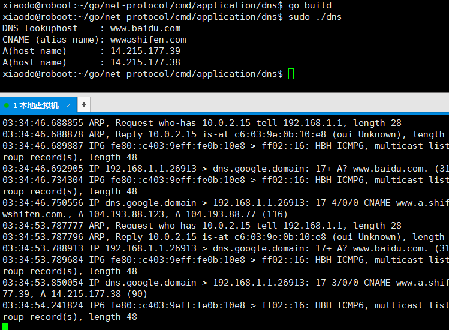
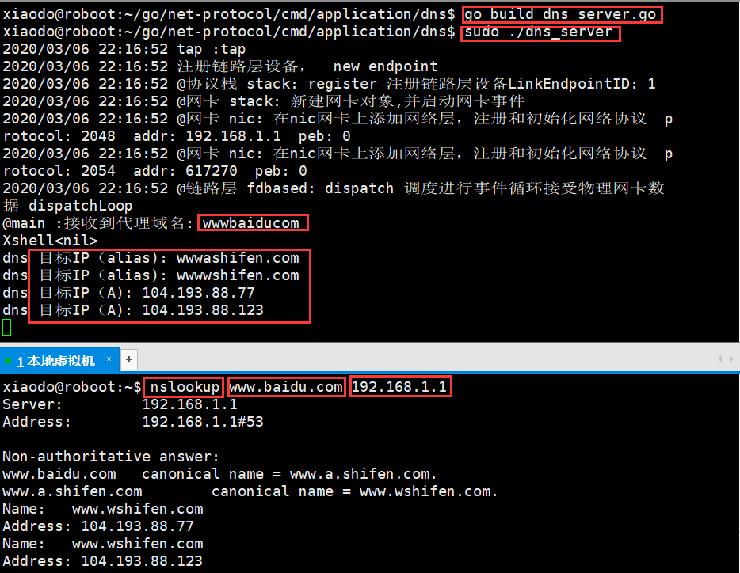

[toc]
# DNS ClIENT
```
> cd net-protocol/tool;
> go build up.go
> sudo ./up

> cd net-protocol/cmd/application/dns
> sudo go run dns_client.go
```



# DNS SERVER
启动 udp server,另起窗口发送dns查询并指定dnsserver
```
> cd net-protocol/tool;
> go build up.go
> sudo ./up

> cd net-protocol/cmd/application/dns
> sudo go run dns_server.go
//另起ssh窗口 发送dns查询并指定自定义的dns server 192.168.1.1:53
> nslookup www.baidu.com 192.168.1.1
```
