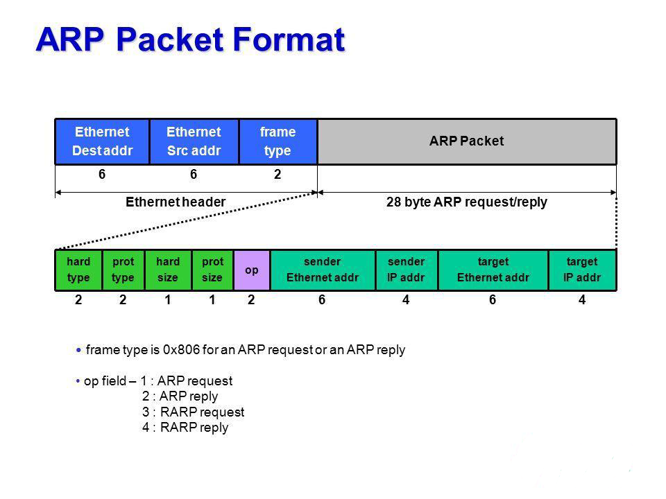

# arp协议
arp协议主要用户获取ip对应的mac物理地址，主机和主机间通信是基于mac物理地址通信的，所有arp协议正为此而生，

arp有一个本地的arp缓存表，用来缓存本地arp映射关系，加快网络请求，不必在通信的时候每次去广播查询mac地址
## arp 

硬件类型(hard type) 硬件类型用来指代需要什么样的物理地址，如果硬件类型为 1，表示以太网地址

协议类型 协议类型则是需要映射的协议地址类型，如果协议类型是 0x0806，表示 arp 协议。

硬件地址长度 表示硬件地址的长度，单位字节，一般都是以太网地址的长度为 6 字节。

协议地址长度：
表示协议地址的长度，单位字节，一般都是 ipv4 地址的长度为 4 字节。

操作码 这些值用于区分具体操作类型，因为字段都相同，所以必须指明操作码，不然连请求还是应答都分不清。
1=>ARP 请求, 2=>ARP 应答，3=>RARP 请求，4=>RARP 应答。

源硬件地址 源物理地址，如02:f2:02:f2:02:f2

源协议地址 源协议地址，如192.168.0.1

目标硬件地址 目标物理地址，如03:f2:03:f2:03:f2

目标协议地址。 目标协议地址，如192.168.0.2
## arp 测试
启动网卡 注册相关协议 ip协议 arp协议 以太网协议，icmq协议等，接受网卡原始数据
```
cd arp;
go build
sudo ./arp tap1 192.168.1.1/24


registration.go:364: @协议栈 stack: register 注册链路层设备LinkEndpointID: 1
stack.go:506: @网卡 stack: 新建网卡对象,并启动网卡事件
nic.go:225: @网卡 nic: 在nic网卡上添加网络层，注册和初始化网络协议  protocol: 2048  addr: 192.168.1.1  peb: 0
nic.go:225: @网卡 nic: 在nic网卡上添加网络层，注册和初始化网络协议  protocol: 2054  addr: 617270  peb: 0
endpoint.go:190: @链路层 fdbased: dispatch 调度进行事件循环接受物理网卡数据 dispatchLoop


endpoint.go:208: @链路层 fdbased: step1 物理网卡接受数据read 42 bytes
endpoint.go:226: @链路层 fdbased: step2 解析以太网协议: [255 255 255 255 255 255 102 226 79 243 181 144 8 6 0 1 8 0 6 4 0 1 102 226 79 243 181 144 10 105 121 88 0 0 0 0 0 0 192 168 1 1 0 0 0 0 0 0 0 0 0 0 0 0 0 0 0 0 0 0 0 0 0 0 0 0 0 0 0 0 0 0 0 0 0 0 0 0 0 0 0 0 0 0 0 0 0 0 0 0 0 0 0 0 0 0 0 0 0 0 0 0 0 0 0 0 0 0 0 0 0 0 0 0 0 0 0 0 0 0 0 0 0 0 0 0 0 0] 2054 66:e2:4f:f3:b5:90 ff:ff:ff:ff:ff:ff
nic.go:432: @网卡 nic: step3 nic网卡解析以太网协议,分发到对应的 网络层 协议处理 
arp.go:92: @网络层 arp: step1 : 解析arp数据包，包括arp请求和响应
arp.go:103: @网络层 arp: step2 : 解析arp请求
stack.go:777: @网卡 stack: 协议解析 nicid: 1  protocol: 2048  addr: 192.168.1.1
arp.go:115: @网络层 arp: reply: 发送arp回复
endpoint.go:116: @链路层: fdbased 写入网卡数据  0x4bfa10
linkaddrcache.go:152: @路由表 route: linkaddrcache 路由表缓存 1:10.105.121.88:0-66:e2:4f:f3:b5:90
endpoint.go:208: @链路层 fdbased: step1 物理网卡接受数据read 98 bytes
endpoint.go:226: @链路层 fdbased: step2 解析以太网协议: [102 226 79 243 181 144 102 226 79 243 181 144 8 0 69 0 0 84 177 10 64 0 64 1 68 52 10 105 121 88 192 168 1 1 8 0 198 16 8 142 0 1 228 111 111 93 0 0 0 0 19 192 3 0 0 0 0 0 16 17 18 19 20 21 22 23 24 25 26 27 28 29 30 31 32 33 34 35 36 37 38 39 40 41 42 43 44 45 46 47 48 49 50 51 52 53 54 55 0 0 0 0 0 0 0 0 0 0 0 0 0 0 0 0 0 0 0 0 0 0 0 0 0 0 0 0 0 0] 2048 66:e2:4f:f3:b5:90 66:e2:4f:f3:b5:90
nic.go:432: @网卡 nic: step3 nic网卡解析以太网协议,分发到对应的 网络层 协议处理 
ipv4.go:159: @网络层 ipv4: handlePacket 数据包处理
icmp.go:76: @网络层 icmp: 接受报文:echo
icmp.go:132: @网络层 icmp: 响应报文：传递给ip层处理
ipv4.go:151: @网络层 ipv4: 接受传输层数据 封装ip头部信息，写入链路层网卡数据 send ipv4 packet 84 bytes, proto: 0x1
endpoint.go:116: @链路层: fdbased 写入网卡数据  0x4bfa10


```
发送ping包，arp查询等
```
ping 192.168.1.1

PING 192.168.1.1 (192.168.1.1) 56(84) bytes of data.
64 bytes from 192.168.1.1: icmp_seq=1 ttl=255 time=1.16 ms

```

